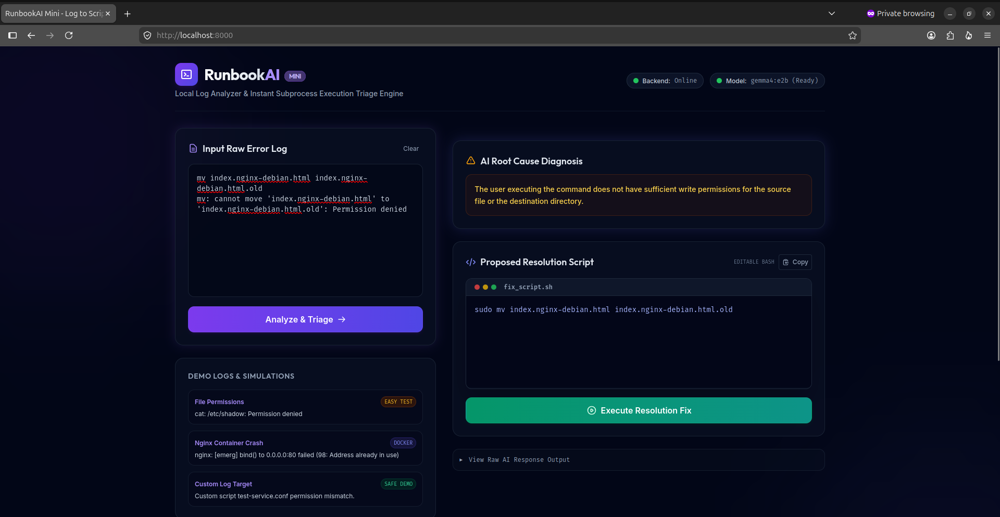

# RunbookAI Mini 🚀



RunbookAI Mini is an **Intelligent Error Triage Web App** that acts as a "Log to Script" fixer. It provides developers and system administrators with immediate root-cause diagnostics and ready-to-run resolution scripts from raw Linux system logs, Docker errors, or service crash messages.

Built as a lightweight, single-page dashboard with rich modern aesthetics, it integrates a local FastAPI backend, an interactive Bash script editor, a retro shell console, and an end-to-end local demo simulator.

---

## 🛠 Architecture & Mechanics

```
[ Simple React-Like Frontend ] ──(Post Log / Run Script)──> [ FastAPI Backend ]
                                                              │   │
                     ┌────────────────────────────────────────┘   │
                     ▼ (Subprocess Exec)                          ▼ (Port 11434)
             [ Local Host System ]                         [ Local Ollama Engine ]
```

- **Frontend**: A futuristic slate-dark dashboard using Tailwind CSS and vanilla Javascript, featuring live status badges, SVG micro-animations, and a console terminal.
- **FastAPI Backend (`main.py`)**: Connects to the local Ollama API, parses LLM output into structured JSON, and executes scripts locally using Python's `subprocess` (guarded with a 15-second execution timeout).
- **Ollama AI Engine**: Evaluates log context using `gemma4:e2b` to diagnose the root cause and generate a tailored resolution script.

---

## 📁 Repository Structure

```text
runbook-mini/
├── Dockerfile             # Container build specification
├── docker-compose.yml     # Multi-container local execution setup
├── main.py                # Single-file FastAPI backend & simulator APIs
├── README.md              # Document you are reading
├── .gitignore             # Git ignore file (excludes virtual environment)
└── frontend/
    ├── index.html         # Slate-dark HTML frontend with offline font support
    ├── app.js             # Client-side API fetchers, polling, & terminal log styling
    └── tailwind.min.js    # Locally cached Tailwind compiler (100% offline capability)
```

---

## 🚀 Quick Start

### Option A: Local Python Run (Recommended)

1. **Verify Ollama**: Make sure Ollama is running and has the `gemma4:e2b` model loaded:
   ```bash
   ollama run gemma4:e2b
   ```
2. **Install Dependencies**:
   Create a virtual environment and install the required Python packages (`fastapi`, `uvicorn`, `requests`, `pydantic`):
   ```bash
   python3 -m venv .venv
   source .venv/bin/activate
   pip install fastapi uvicorn requests pydantic
   ```
3. **Run the Application**:
   Start the FastAPI development server:
   ```bash
   uvicorn main:app --host 127.0.0.1 --port 8000 --reload
   ```
4. **Access the App**:
   Open [http://localhost:8000](http://localhost:8000) in your browser.

### Option B: Docker Compose Run

1. **Build and Start Container**:
   ```bash
   docker-compose up --build -d
   ```
   *Note: This automatically routes the web container to access your host's Ollama instance at `host.docker.internal:11434`.*
2. **Access the App**:
   Open [http://localhost:8000](http://localhost:8000) in your browser.

---

## 🎬 E2E Winning Demo Scenario

RunbookAI Mini contains a built-in sandbox simulator to test a full **"break-diagnose-fix"** lifecycle locally:

1. **Trigger a Break**: Click **Break Config File (chmod 000)** under the *E2E Demo Simulator* card.
   - This creates a mock file `test-service.conf` in the project root and strips all read/write permissions.
   - The *Config File Status* badge will immediately flash red: **Locked (000)**.
2. **Submit Log**: Click the **Custom Log Target** preset button to load the crash trace:
   ```text
   CRITICAL:test-service: Could not load configuration file /home/mohammed/RunbookAI/test-service.conf: Permission denied
   ```
   Click **Analyze & Triage**.
3. **The Diagnostics**: The local `gemma4` model will parse the log, displaying:
   - **Root Cause**: `"The user or service attempting to load the configuration file does not have the necessary read permissions..."`
   - **Proposed Resolution Script**: A generated `chmod 644 /home/mohammed/RunbookAI/test-service.conf` command in the script editor.
4. **Execute Fix**: Review/edit the script in the terminal box, then click **Execute Resolution Fix**.
5. **Observe Resolution**:
   - The retro shell terminal prints the command execution logs and exit status.
   - The file status badge turns emerald green: **Readable (0o644)**.
   - The terminal reports **EXIT 0 (SUCCESS)**.
